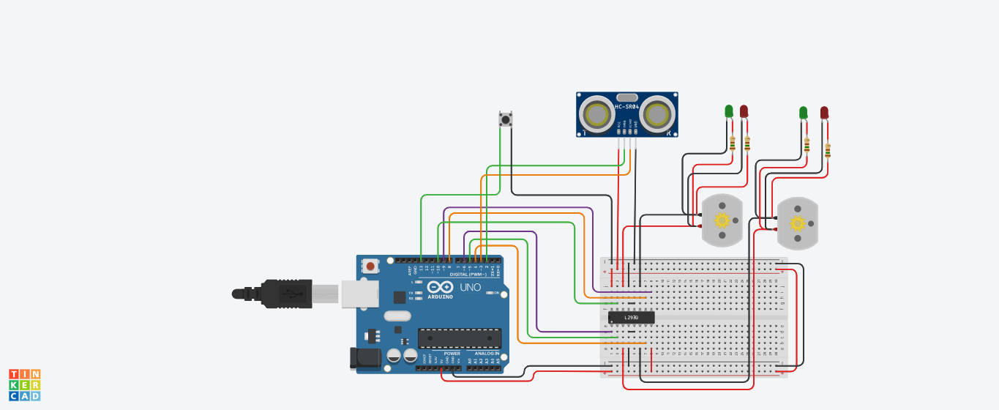

# arduino-surface-scan
Projeto para escanear uma superfície e retornar uma representação gráfica em 3D do relevo.

O código para geração do gráfico 3D foi obtido desta fonte:
https://www.geodose.com/2019/09/3d-terrain-modelling-in-python.html

O código para captura dos dados do terminal serial foi obtido desta fonte:
https://www.youtube.com/watch?v=liHYMVjlIsQ&ab_channel=FunBots

Nas fontes há uma explicação detalhada do funcionamento de cada código.
Este projeto se encontra ainda em produção, por isso os códigos podem acabar sendo extremamente modificados a depender da necessidade.

O esquema de montagem do circuito pode ser encontrado em:
https://www.tinkercad.com/things/ay2l9EChgR0

# Esquema de montagem da simulação:

Obs.: Os leds não estarão presentes no projeto físico, pois foram apenas um artifício para visualizar com mais facilidade o sentido de rotação dos motores durante a simulação.
